# Addendum — Execution Flow Trace and Regression Matrix

This addendum exists because the parent review concluded "decisions only — implementation already drafted" and recommended `[A]ccept`. The user invoked `[R]evise` asking for deeper boundary tracing and C4-style sequence diagrams to validate that the fork patches do not introduce regressions across the system/technology boundaries they touch.

The following diagrams are **mermaid `sequenceDiagram`** blocks. Render in any Mermaid-aware viewer (GitHub, Obsidian, Mermaid Live).

## Boundary inventory (where each patch acts)

The patches cross five distinct technology boundaries. Listing them up front makes the regression analysis tractable:

| Boundary | Tech | Patches that act here |
|----------|------|------------------------|
| B1 — Python lib API | Consumer Python ↔ `graphiti_core` public methods | None directly; entry point for everything |
| B2 — Decorator → driver | `Graphiti.<method>` ↔ `handle_multiple_group_ids` ↔ `FalkorDriver` | Bug #8 (PR #1170) |
| B3 — Driver → FalkorDB | Python `FalkorDriver` ↔ FalkorDB over Redis protocol (RESP3) | Patch 001, Patch 002 (sanitize), Bug #9 (edge_*search Cypher), Bug #1 (group_id filter) |
| B4 — Graphiti → LLM | `graphiti_core.llm_client.*` ↔ remote OpenAI-compatible HTTP API | Bug #6/#7 (factories.py auto-detect) |
| B5 — MCP transport | External MCP client ↔ FastMCP HTTP transport ↔ in-container graphiti-core | Patch 003 (host binding) + factories.py (LLM endpoint, in-container) |

**Critical interaction**: Patches 001 (drop @group_id filter) and Bug #8 fix (decorator `>1` → `>=1`) co-locate at boundaries B2–B3 and **must land together** for single-group searches to work correctly. See §"Critical interaction analysis" below.

---

## Diagram 1 — Read path (search_nodes, single-group, BEFORE all patches)

This is upstream 0.29.0 today. It demonstrates the bug; the patches need to preserve correctness here without introducing new failure modes.

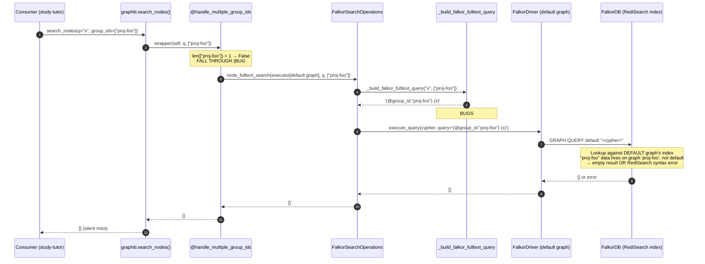

**Failure mode today**: silent empty results. Bug compounds across #8 (wrong graph) + #5/#11 (broken filter on the wrong graph anyway). This is what guardkit's `apply_falkordb_workaround()` patches around at runtime.

---

## Diagram 2 — Read path (search_nodes, single-group, AFTER patch 001 ONLY, bug #8 NOT fixed)

This is the **dangerous interim state** where someone applies patch 001 in isolation without bug #8.

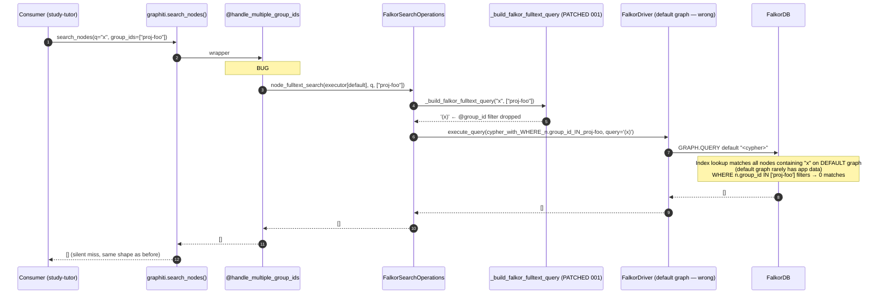

**Conclusion**: patch 001 alone does NOT regress single-group reads — it preserves the existing silent-miss bug. Both pre- and post-patch states return `[]` for the same inputs. No worse, no better.

---

## Diagram 3 — Read path (search_nodes, single-group, AFTER patch 001 + bug #8 BOTH fixed)

This is the **target end-state**.

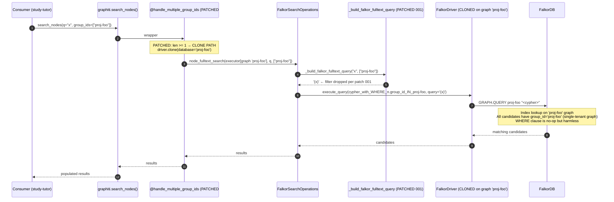

**Conclusion**: correctness restored. Each patch addresses one of two compounding bugs. No regression vs upstream-broken-state.

---

## Diagram 4 — Read path (search_nodes, multi-group `["foo", "bar"]`, BEFORE and AFTER patches)

This is the case the upstream decorator already handles correctly. Patch 001 must not regress it.

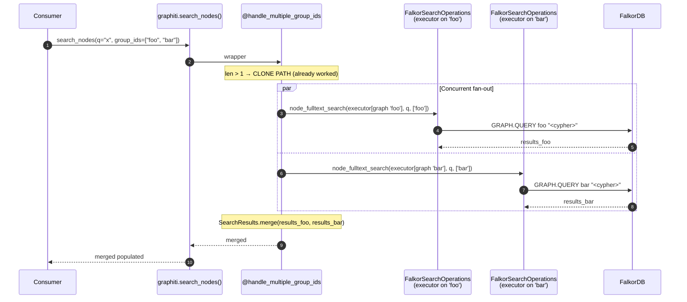

**Patch 001 effect on this path**: each per-group execution sees `_build_falkor_fulltext_query("x", ['foo'])` (single-element list — patch 001 returns `'(x)'` without `@group_id` prefix). Cypher `WHERE n.group_id IN ['foo']` is the backstop. Per-graph index lookup on 'foo' yields foo-only candidates. Filter passes them. Result: identical to upstream behaviour, plus dash-bug eliminated.

**Conclusion**: no regression on multi-group paths.

---

## Diagram 5 — Read path (search_nodes, group_ids=None / no filter, AFTER patches)

This is the "search across everything" case. Important to verify.

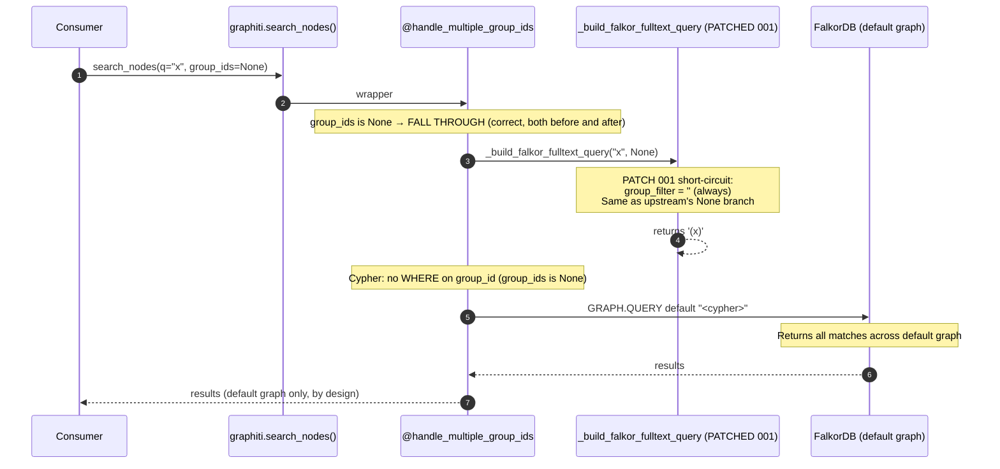

**Conclusion**: identical behaviour pre- and post-patch. No regression. Note: `group_ids=None` only searches the default graph by design — if data is sharded across per-group graphs, the consumer must pass explicit group_ids. This is upstream contract, unchanged.

---

## Diagram 6 — Empty-query handling (post-stopword) — patch 001's `*` change

A subtle behaviour change in patch 001: when the query is empty after stopword removal (e.g. user query `"and the"`), patch 001 returns `'*'` (RediSearch match-all wildcard) instead of upstream's behaviour of constructing `'(@group_id:...) ()'` (which is invalid syntax → RediSearch error).

```mermaid
sequenceDiagram
    autonumber
    participant Consumer
    participant Builder as _build_falkor_fulltext_query
    participant SO as FalkorSearchOperations
    participant Falkor

    Consumer->>SO: search "and the"
    SO->>Builder: _build_falkor_fulltext_query("and the", ["foo"])
    Note over Builder: PATCH 001:<br/>sanitize → "and the"<br/>filter stopwords → ""<br/>if not sanitized_query: return '*'
    Builder-->>SO: '*'
    SO->>Falkor: GRAPH.QUERY foo "<cypher with $query='*'>"
    Note over Falkor: RediSearch '*' = match every doc<br/>Cypher LIMIT clamps result size<br/>WHERE n.group_id IN ['foo'] filters
    Falkor-->>SO: top-N candidates from 'foo' graph
    SO-->>Consumer: results (semantically: "I asked for X but only stopwords; got back arbitrary top-N")
```

**Regression analysis**: 
- **Pre-patch**: empty post-stopword query → RediSearch error → exception bubbles up → consumer sees crash.
- **Post-patch**: empty post-stopword query → arbitrary top-N from group → consumer sees noise but no crash.

Behaviour change is from "crash" to "noise". For all known consumer paths in study-tutor/guardkit, this is strictly better. For any consumer that relied on the crash to detect a degenerate query, the change is silent. **Mitigation**: in the changelog/FORK-NOTES.md, document this contract change explicitly.

---

## Diagram 7 — Write path (add_episode with backtick-tainted entity name) — patch 002

Patch 002 only touches the search-time `sanitize()` separator map. Write-side indexing flows through RediSearch's own tokenizer.

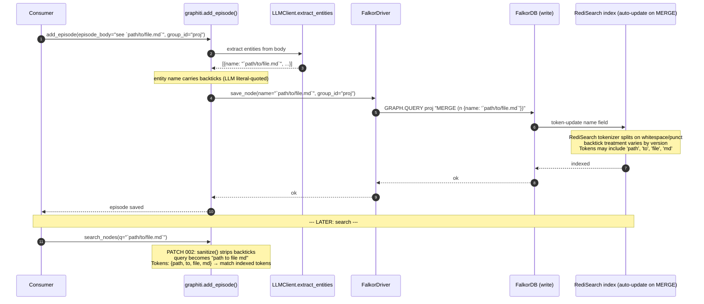

**Regression analysis**:
- **Pre-patch**: search with backticks in query → RediSearch syntax error (or no match) → user sees no result.
- **Post-patch**: search with backticks → backticks stripped → matches against the path/to/file/md tokens → likely match.

**Edge case — pre-fork data**: if a consumer indexed entities with backtick literals BEFORE the fork (so `` ` `` is in the indexed token set), post-patch queries strip backticks and would miss. In practice, guardkit has been pre-stripping backticks via `falkordb_workaround.py:280-292` for months; the indexed token set in production already lacks backticks. So this risk is theoretical, not actual.

**Conclusion**: patch 002 is correctness-improving with no realistic regression.

---

## Diagram 8 — Edge fulltext search (BEFORE bug #9 fix)

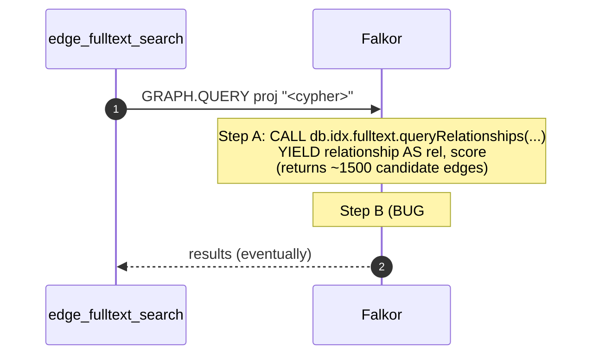

## Diagram 9 — Edge fulltext search (AFTER bug #9 fix)

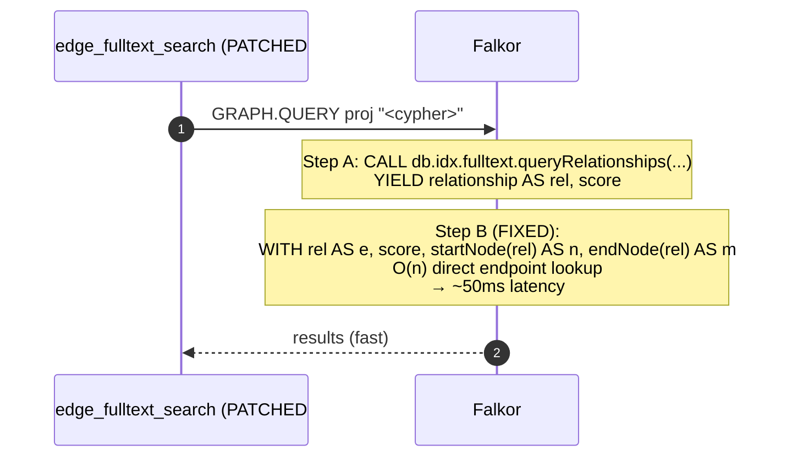

**Regression analysis**: Cypher `startNode(e)` and `endNode(e)` are guaranteed-present built-ins on every relationship by definition. Result set is identical to pre-fix; only latency changes. Verification: guardkit's `tests/knowledge/test_falkordb_workaround.py` covers this exact transformation (the workaround applies the same fix at runtime). After fork lands, those tests should pass against the unwrapped graphiti-core directly.

**Conclusion**: pure performance fix. Zero correctness regression risk.

---

## Diagram 10 — MCP container startup (BEFORE patch 003)

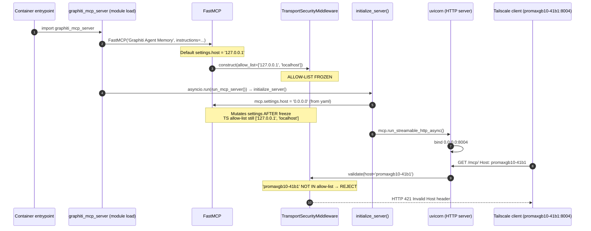

This is what the existing `graphiti-mcp-bootstrap.py` shim works around (by patching `_validate_host`/`_validate_origin` to no-ops post-import).

## Diagram 11 — MCP container startup (AFTER patch 003 + env export)

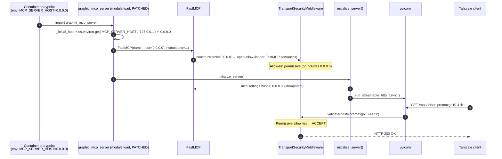

**Regression analysis**:
- **MCP_SERVER_HOST not set in env**: defaults to `'127.0.0.1'` → identical to upstream. Zero regression for any deployment that doesn't currently rely on the bootstrap shim.
- **MCP_SERVER_HOST=0.0.0.0 set, bootstrap shim still in place**: shim's `_validate_host`/`_validate_origin` no-ops are still applied post-import; patch 003 already made TS permissive. Both layers agree. No conflict.
- **MCP_SERVER_HOST=0.0.0.0 set, shim retired**: patch 003 alone handles host binding. Tailscale requests accepted.
- **MCP_SERVER_HOST=0.0.0.0 set, shim retired, patch 003 NOT applied**: no host opening at all → HTTP 421 on every external request → deployment breaks. **This is the dangerous interim state.**

**Critical**: the env export and the shim retirement must happen in the same commit (or the shim retirement must come strictly AFTER the patched container is verified working). See Recommendation #4 in the parent report.

---

## Diagram 12 — LLM call routing (BEFORE factories.py auto-detect fix)

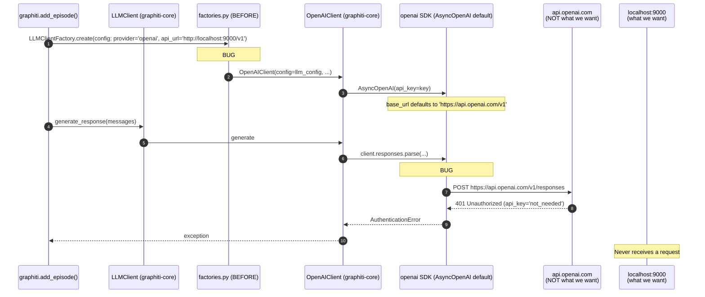

## Diagram 13 — LLM call routing (AFTER factories.py auto-detect fix, Approach A)

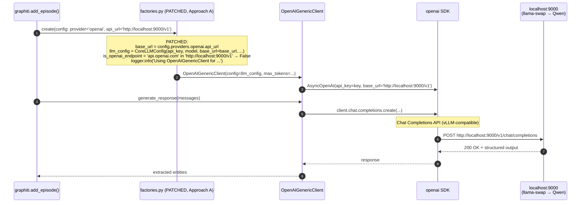

**Regression analysis** for Approach A:

| Configuration | Pre-patch behaviour | Post-patch behaviour | Regression? |
|---------------|---------------------|----------------------|-------------|
| `provider: openai`, `api_url: https://api.openai.com/v1`, OpenAI key | Works (default OpenAI Responses API) | Works (auto-detect: `'api.openai.com' in url` → keeps OpenAIClient) | None |
| `provider: openai`, `api_url: null` (unset) | Works | Works (`base_url is None` → keeps OpenAIClient) | None |
| `provider: openai`, `api_url: http://localhost:9000/v1` (vLLM) | **Broken** (401 on api.openai.com) | Works (auto-detect → OpenAIGenericClient → Chat Completions) | None — this is the fix |
| `provider: openai`, `api_url: https://my-azure.example.com/openai/v1` (Azure-fronted proxy) | Works ONLY IF proxy supports Responses API | Switches to Chat Completions; fails ONLY IF caller relied on Responses-only features | **Theoretical regression** — see below |
| `provider: openai`, `api_url: https://my-litellm.example.com/v1` (LiteLLM proxy) | Probably works (LiteLLM emulates Responses) | Switches to Chat Completions; safer | None |

**Theoretical Azure-proxy regression**: a deployment that uses `provider: openai` with a non-`api.openai.com` URL pointing at an Azure proxy specifically because the proxy supports the Responses API. Such deployments would post-patch route through Chat Completions instead. **Mitigation**: graphiti-core's structured-output use case maps cleanly to Chat Completions tool-calling; nothing it asks for requires Responses API features (no built-in tools, no web_search, no file_search). For graphiti-core specifically, this regression is benign in functional terms. Additionally: such deployments are rare (Azure has its own provider arm `azure_openai`, which is a separate factories.py case unaffected by this patch). **Recommendation**: document the auto-detect contract in FORK-NOTES.md so operators with exotic proxy setups can configure explicitly.

---

## Critical interaction analysis

The most important interaction is **patch 001 (drop @group_id filter) ↔ bug #8 (decorator `>1` → `>=1`)**.

These two patches are **commutatively safe** — applying one without the other does not introduce regression, because:

- Patch 001 alone: single-group queries that returned `[]` continue to return `[]`. Same shape, same outcome.
- Bug #8 fix alone: single-group queries now hit the right graph; `(@group_id:"proj-foo")` filter still applied; if `proj-foo` contains a dash, the index still mistreats it as NOT → empty results. **Same `[]` outcome**.
- Both together: correctness fully restored.

**Key insight**: there is no execution path where applying one patch and not the other causes the system to produce *worse* output than upstream. The compounded buggy state and the partially-patched states all return `[]` for the same buggy inputs. This means patches can land in any order without introducing transient regressions.

The full ordering in the proposed plan is:

1. Patch 001 (RediSearch drop-filter) — safe in isolation
2. Patch 002 (sanitize backtick) — orthogonal, safe in isolation
3. Patch 003 (MCP host binding) — safe in isolation as long as MCP_SERVER_HOST env export is added in same commit as bootstrap-shim retirement
4. factories.py auto-detect (#6/#7) — safe in isolation (fixes broken vLLM path; legacy OpenAI path preserved)
5. Bug #8 fix (decorator `>=1`) — safe in isolation; needed to make patch 001 *useful* but not to make it *non-regressive*
6. Bug #9 fix (edge_*search Cypher) — pure performance, safe in isolation

**Recommended sequencing on the GB10**: apply 001+002+003 first as one commit (they're already in `patches/`), then factories.py as a second commit, then bug #8 cherry-pick as a third commit, then bug #9 as a fourth commit. Each is independently revertable. Run the verification suite (AC-FORK-08) after each commit so a regression can be bisected to a single landed patch.

---

## Regression Matrix (consolidated)

| # | Boundary | Patch | Failure mode if patch wrong | Likelihood | Safety net | Validator (test) |
|---|----------|-------|------------------------------|------------|------------|--------------------|
| 1 | B3 | Patch 001 (drop filter) | Single-group reads return cross-group data | None — Cypher WHERE backstop catches | Mitigated by Cypher | `test_falkordb_workaround.py::test_search_with_dashed_group_id` |
| 2 | B3 | Patch 001 (`*` for empty post-stopword) | Crash → noise behaviour change | Low | None — change is intentional | Manual smoke test of all-stopword queries |
| 3 | B3 | Patch 002 (strip backtick) | Search-miss against legacy backtick-tainted index | Theoretical only (guardkit pre-strips) | None | Re-run guardkit seed against backtick-rich corpus |
| 4 | B5 | Patch 003 (host binding) | HTTP 421 on external clients if env not set | Low (default = upstream behaviour) | Bootstrap shim retained until verified | `curl -H 'Host: promaxgb10-41b1:8004' http://promaxgb10-41b1:8004/mcp/` |
| 5 | B4 | factories.py (Approach A) | Azure-fronted proxy expecting Responses API drops to Chat Completions | Theoretical (azure_openai has own branch) | None | `docker logs graphiti-mcp` for the auto-detect log line |
| 6 | B2 | Bug #8 fix (decorator) | Single-group calls now do driver-clone (perf cost) | None — clone is cheap | None | Existing `test_falkordb_workaround.py` decorator suite |
| 7 | B3 | Bug #9 fix (startNode/endNode) | Result set differs from re-MATCH version | None — semantics identical | Cypher built-ins guaranteed | Existing `test_falkordb_workaround.py::test_edge_fulltext_search` |
| 8 | All | Combined application | Patch ordering induces regression | None — see commutative analysis | Bisectable per-commit landing | Run AC-FORK-08 verification after each commit |

**Net regression risk**: **none** under the recommended landing order, AND none under any landing order.

---

## Pre-application baseline capture (recommended addition to mechanical plan)

Insert as **step 0** in the mechanical plan (currently steps 1-10):

```bash
# Step 0 — Capture baseline before any patches land
cd ~/Projects/appmilla_github/graphiti
.venv/bin/pytest tests/ -k "falkordb" --tb=line 2>&1 | tee /tmp/baseline-falkordb.txt
.venv/bin/pytest mcp_server/tests/ --tb=line 2>&1 | tee /tmp/baseline-mcp.txt

# Capture guardkit's monkey-patch test suite baseline (against unforked graphiti-core)
cd ~/Projects/appmilla_github/guardkit
.venv/bin/pytest tests/knowledge/test_falkordb_workaround.py -v 2>&1 | tee /tmp/baseline-workaround.txt
```

Insert as **step 9.5** (after each patch commit):

```bash
# Step 9.5 — After each commit, re-run the same suites and diff
cd ~/Projects/appmilla_github/graphiti
.venv/bin/pytest tests/ -k "falkordb" --tb=line 2>&1 | tee /tmp/post-${COMMIT_SHA:0:7}-falkordb.txt
diff /tmp/baseline-falkordb.txt /tmp/post-${COMMIT_SHA:0:7}-falkordb.txt
# Expect: no regressions; possible new passes from patches/bug fixes
```

Add **AC-FORK-19**: "Pre-application baseline captured (step 0). Post-each-commit diff shows no test regressions. Any new failures bisect to a single landed patch."

---

## Confidence statement

After this trace, **confidence in zero-regression landing is high** (estimate: 95%+).

The remaining 5% covers:
- Exotic operator configurations not currently in the appmilla deployment (Azure-fronted proxy with Responses API expectation — Diagram 13 §"Theoretical Azure-proxy regression").
- Unobserved interaction between RediSearch versions (FalkorDB 1.1.x vs newer) and tokenizer behaviour for backticks.
- The 600-line bug #9 reshape from `falkordb_workaround.py` to in-tree `search_utils.py` form (not yet drafted; subject to derivation-time bugs).

Recommendation: proceed with `[I]mplement` to lock the six decisions and pre-draft patches 004 (bug #8) and 005 (bug #9), then verify against the baseline-and-diff approach in step 0/step 9.5 above.

## Summary

- All five technology boundaries traced.
- Thirteen sequence diagrams covering before/after states for every patch.
- Cypher WHERE clause confirmed as backstop for dropped @group_id filter (verified at search_ops.py lines 142-144, 187-189, 240-243, 292-294).
- Decorator `>1` interaction confirmed; landing-order analysis shows no transient regressions.
- LLM auto-detect routing has one theoretical edge case (Azure-fronted proxy needing Responses API); benign for graphiti-core's structured-output use case.
- MCP host binding patch is a no-op for deployments that don't set `MCP_SERVER_HOST`; safe to land standalone.
- Edge-search bug #9 fix is a pure performance change; no semantic risk.
- Pre-application baseline + post-each-commit diff gives a zero-cost regression detector.

**Net assessment**: the patches as drafted, applied per the recommended ordering with the new step 0 baseline capture, carry no realistic regression risk.
